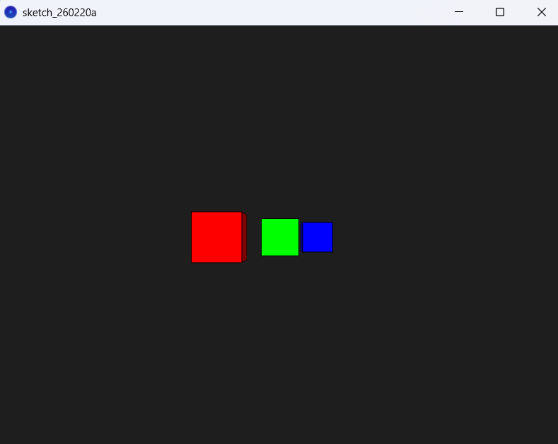
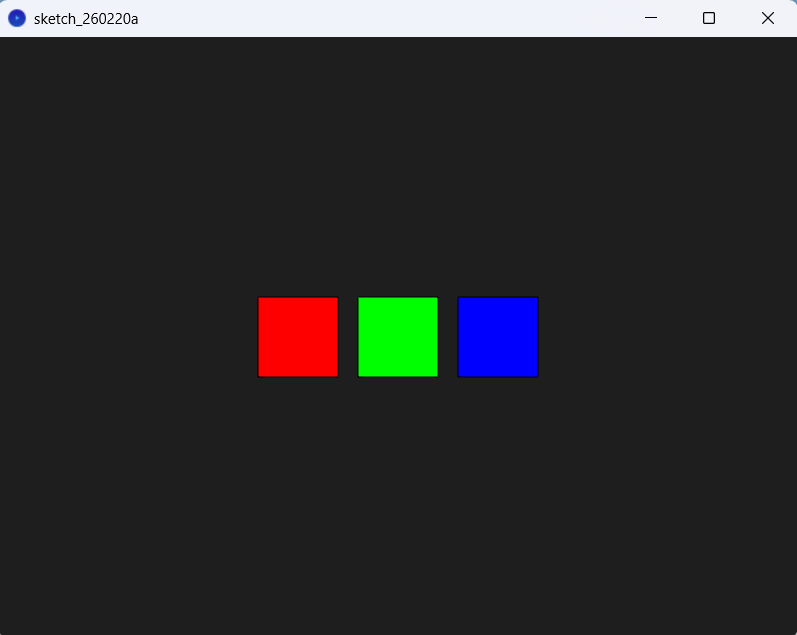

# Taller Espacios Proyectivos y Matrices de Proyección
Sebastián Andrade Cedano

Entregado: 27 Feb 2026

## Objetivo

## Implementaciones

### Python

Para esta implementación, se definieron 3 puntos en 3D con coordenadas homogeneas.
```
puntos = np.array([
    [1,2,1,1],
    [3,4,5,1],
    [2,1,2,1]
]).T

```
Primero se hizo un plot con los 3 puntos en 3D con colores amarillo, azul y rojo, respectivamente, para hacerse a a la idea de como se ven estos en un espacio 3D.


Luego se definió la siguiente función, para poder graficar la perspectiva con diferentes distancias focales.
```
def plot_perspective(dist):
  puntos_proy = proyectar_perspectiva(puntos, d=dist)
  plt.figure()

  for i in range(puntos_proy.shape[1]):
      plt.scatter(
          puntos_proy[0, i],
          puntos_proy[1, i],
          color=colores[i],
          s=100
      )

  plt.xlabel("X proyectado")
  plt.ylabel("Y proyectado")
  plt.title(f"Proyección en Perspectiva d={dist}")
  plt.axhline(0)
  plt.axvline(0)
  plt.xlim(-5, 5)
  plt.ylim(-5, 5)

  plt.show()
```

Los gráficos obtenidos fueron los siguientes.


Y por último la proyección ortogonal.


### Unity

Para esta escena se colocaron 3 cubos alineados en el eje Z. Lo primero que observamos es como se ven estos a través de la cámara con proyección en perspectiva, la cual es la configuración por default de Unity.


Ahora observamos la cámara en proyección ortogonal


Ahora, de vuelta en la proyección en perspectiva vamos a proceder a cambiar los valores de `Field of View (FOV)` y los clipping plane `Near` y `Far`. Para observar que efecto tienen estos en la forma en la que vemos los cubos.

Con un FOV de 30, el cual es la mitad del FOV por defecto, observamos que al ser encogido el frustrum, se recorta una parte de los cubos.


Ahora, si ajustamos el `Near` justo en 3.5 que es cuando empieza a rozar con los cubos, vemos que estos no se dibujan de manera apropiada, debido a que su cara frontal no está dentro del espacio que la cámara proyecta.


### Processing

Para el ejercicio en processing, ubicamos 3 cubos con diferentes valores de `z`, y definimos una variable booleana para poder decidir si se iba a presentar la vista ortogonal o en perspectiva.

```
  pushMatrix();
  translate(-100, 0, -100);
  fill(255, 0, 0);
  box(80);
  popMatrix();

  pushMatrix();
  translate(0, 0, -300);
  fill(0, 255, 0);
  box(80);
  popMatrix();

  pushMatrix();
  translate(100, 0, -500);
  fill(0, 0, 255);
  box(80);
  popMatrix();
```
#### Proyección en perspectiva


#### Proyección ortogonal


## Aprendizajes y dificultades
* Las "Cámaras" en motores gráficos son en realidad una matriz de proyección.