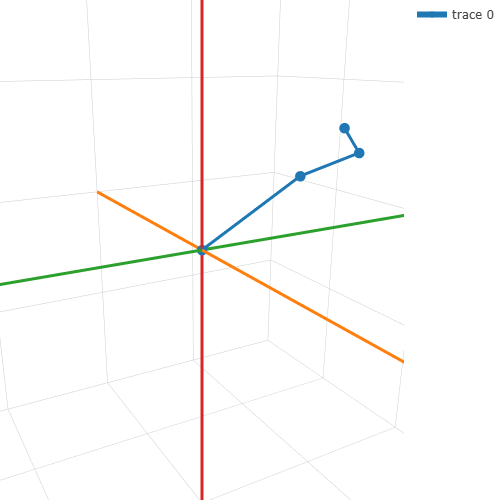

# Taller transformaciones homogéneas y cambios de base

Sebastián Andrade Cedano

Entregado: 27 Feb 2026

## Objetivo

El taller aplicar transformaciones y coordenadas homogeneas en róbotica y gráficos por computador.

## Implementaciones

### Brazo róbotico en Python

El modelo que se vá a utilizar consiste en un brazo con 3 articulaciones (hombro, codo, muñeca, o shoulder, elbow and wrist en inglés). Y existe una herencia de forma que el codo, y muñeca heredan el movimiento del hombro, la muñeca y la mano el del codo, y la muñeca se encarga únicamente de mover la mano. Cada una de esas partes del brazo tiene su sistema de coordenadas independiente, y el hombro se encuentra anclado al origen por simplicidad.



Cada articulación tiene dos matrices de transformación, una local, representando sus coordenadas con respecto al padre, y otra global, representando las coordenadas con respecto al mundo, la cual se define de la siguiente forma:

$$M_{global hijo} = M_{global padre} * M_{local hijo}$$

Y en nuestro modelo, debido a que el codo rota con respecto al hombro (el cual está en el origen), entonces se tiene que:

$$ M_{global codo} = M_{local codo}$$

Definimos unas coordenadas inciales, y guardamos las matrices "base" para poder hacer las transformaciones en base a estas después.

```
# Coordinates relative to its father (local)
shoulder = np.array([[0,0,0,1]]).T
elbow = np.array([[4,0,0,1]]).T
wrist = np.array([[2,0,0,1]]).T
hand = np.array([[1,0,0,1]]).T

M_elbow = np.eye(4)
M_elbow[:,3] = elbow[:,0]

Ml_wrist = np.eye(4)
Ml_wrist[:,3] = wrist[:,0]
Mg_wrist = M_elbow @ Ml_wrist

Ml_hand = np.eye(4)
Ml_hand[:,3] = hand[:,0]
Mg_hand = Mg_wrist @ Ml_hand


M_elbow_base = M_elbow.copy()
Ml_wrist_base = Ml_wrist.copy()
Mg_wrist_base = Mg_wrist.copy()
Ml_hand_base = Ml_hand.copy()
Mg_hand_base = Mg_hand.copy()
```

Después de definió una función general para obtener la matriz de rotación de cada eje `x,y,z`.

```
def rotationMatrix(theta, axis):
    if axis == 'z':
      return np.array([
          [np.cos(theta), -1*np.sin(theta), 0, 0],
          [np.sin(theta), np.cos(theta), 0, 0],
          [0,0,1,0],
          [0,0,0,1]
      ])
    elif axis == 'x':
        return np.array([
            [1, 0, 0, 0],
            [0, np.cos(theta), -1*np.sin(theta), 0],
            [0, np.sin(theta), np.cos(theta), 0],
            [0,0,0,1]

        ])
    elif axis == 'y':
        return np.array([
            [np.cos(theta), 0, np.sin(theta), 0],
            [0,1,0,0],
            [-np.sin(theta),0,np.cos(theta),0],
            [0,0,0,1]
        ])
    else:
      raise Exception("Invalid axis")
```
Despues se definió una función para manejar las rotaciones de cada articulación y que se encarga de propagar estas rotaciones a sus respectivos hijos

#### Función para rotar la articulación del hombro
```
def rotateShoulder(theta, axis):
    global M_elbow, Ml_wrist, Mg_wrist, Ml_hand, Mg_hand, elbow_t_x, elbow_t_y, elbow_t_z

    if axis == 'z':
      matrix = rotationMatrix(elbow_t_x, 'x') @ rotationMatrix(elbow_t_y, 'y') @ rotationMatrix(theta, 'z')
      elbow_t_z = theta
    elif axis == 'x':
      matrix = rotationMatrix(theta, 'x') @ rotationMatrix(elbow_t_y, 'y') @ rotationMatrix(elbow_t_z, 'z')
      elbow_t_x = theta
    elif axis == 'y':
      matrix = rotationMatrix(elbow_t_x, 'x') @ rotationMatrix(theta, 'y') @ rotationMatrix(elbow_t_z, 'z')
      elbow_t_y = theta
    else:
      raise Exception("Invalid axis")

    # Perform rotation
    M_elbow = matrix @ M_elbow_base

    # Update children
    Mg_wrist = M_elbow @ Ml_wrist
    Mg_hand = Mg_wrist @ Ml_hand
```

#### Función para rotar la articulación del codo
```
def rotateElbow(theta, axis):
    global M_elbow, Ml_wrist, Mg_wrist, Ml_hand, Mg_hand, wrist_t_x, wrist_t_y, wrist_t_z

    if axis == 'z':
      matrix = rotationMatrix(wrist_t_x, 'x') @ rotationMatrix(wrist_t_y, 'y') @ rotationMatrix(theta, 'z')
      wrist_t_z = theta
    elif axis == 'x':
      matrix = rotationMatrix(theta, 'x') @ rotationMatrix(wrist_t_y, 'y') @ rotationMatrix(wrist_t_z, 'z')
      wrist_t_x = theta
    elif axis == 'y':
      matrix = rotationMatrix(wrist_t_x, 'x') @ rotationMatrix(theta, 'y') @ rotationMatrix(wrist_t_z, 'z')
      wrist_t_y = theta
    else:
      raise Exception("Invalid axis")

    # Perform rotation
    Ml_wrist = matrix @ Ml_wrist_base
    Mg_wrist = M_elbow @ Ml_wrist
    # Update children
    Mg_hand = Mg_wrist @ Ml_hand
```

#### Función para rotar la articulación de la muñeca
```
def rotateWrist(theta, axis):
    global M_elbow, Ml_wrist, Mg_wrist, Ml_hand, Mg_hand, hand_t_x, hand_t_y, hand_t_z

    if axis == 'z':
      matrix = rotationMatrix(hand_t_x, 'x') @ rotationMatrix(hand_t_y, 'y') @ rotationMatrix(theta, 'z')
      hand_t_z = theta
    elif axis == 'x':
      matrix = rotationMatrix(theta, 'x') @ rotationMatrix(hand_t_y, 'y') @ rotationMatrix(hand_t_z, 'z')
      hand_t_x = theta
    elif axis == 'y':
      matrix = rotationMatrix(hand_t_x, 'x') @ rotationMatrix(theta, 'y') @ rotationMatrix(hand_t_z, 'z')
      hand_t_y = theta
    else:
      raise Exception("Invalid axis")

    # Perform rotation
    Ml_hand = matrix @ Ml_hand_base
    Mg_hand = Mg_wrist @ Ml_hand
```

Despues de esto se generó un gráfico interactivo con Plotly, el cual permite manejar la rotaciones de cada articulación independiente por medio de sliders.

#### Gráfico interactivo


## Aprendizajes y dificultades
* Fué dificil poder generar el gráfico interactivo de la manera correcta para que no generara parpadeos ni auto-escalamientos extraños que afectaran su estética.
* Es necesaria una matriz de rotación por cada eje cuando se trabaja en tercera dimensión, sin embargo se puede calcular el producto entre estas para tener una única matriz de rotación.